# 轻量级Windows桌面笔记管理软件设计文档

## 1. 概述

本项目旨在开发一款轻量级的Windows桌面端笔记管理软件，提供快速便捷的笔记创建、编辑、分类和检索功能。软件支持边缘隐藏、鼠标唤起等现代化交互体验，确保用户能够高效管理个人知识库。

### 核心特性
- 轻量级桌面应用，资源占用小
- 支持创建和编辑笔记/词条
- 基于标签的分类管理系统
- 边缘隐藏和鼠标唤起功能
- 窗口置顶显示
- 快速检索和浏览功能
- 现代化的用户界面

### 技术栈

| 技术组件 | 选择方案 | 版本要求 |
|---------|---------|---------|
| GUI框架 | PySide6 | ≥6.5.0 |
| UI组件库 | PyQt-Fluent-Widgets | 最新版 |
| 数据库 | SQLite | Python内置 |
| 开发语言 | Python | ≥3.8 |
| 打包工具 | PyInstaller | 最新版 |

## 2. 架构设计

### 2.1 MVC设计模式

本项目采用经典的MVC（Model-View-Controller）设计模式，确保代码的可维护性和可扩展性。

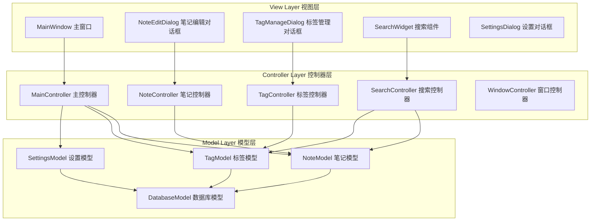

#### MVC层次职责

| 层次 | 职责 | 主要组件 |
|------|------|----------|
| View 视图层 | 用户界面展示，接收用户输入 | MainWindow, Dialog, Widget |
| Controller 控制器层 | 业务逻辑处理，协调View和Model | XXXController类 |
| Model 模型层 | 数据管理和业务规则 | XXXModel类, DAO类 |

#### MVC交互流程

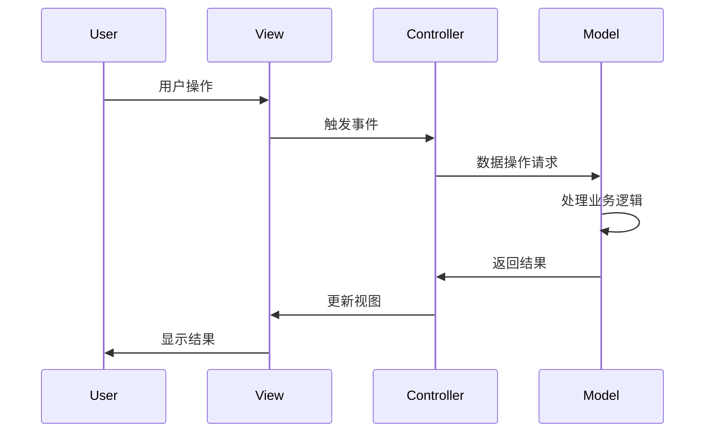

### 2.2 整体架构

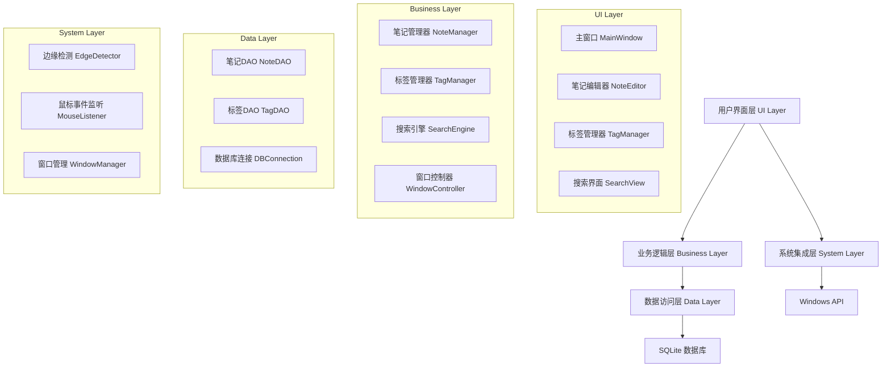

### 2.3 MVC组件详细设计

#### View层组件

| 视图组件 | 功能描述 | 关联Controller |
|----------|----------|----------------|
| MainWindow | 主窗口界面，显示笔记列表和详情 | MainController |
| NoteEditDialog | 笔记编辑对话框 | NoteController |
| TagManageDialog | 标签管理对话框 | TagController |
| SearchWidget | 搜索输入和结果显示 | SearchController |
| SettingsDialog | 应用设置界面 | MainController |

#### Controller层组件

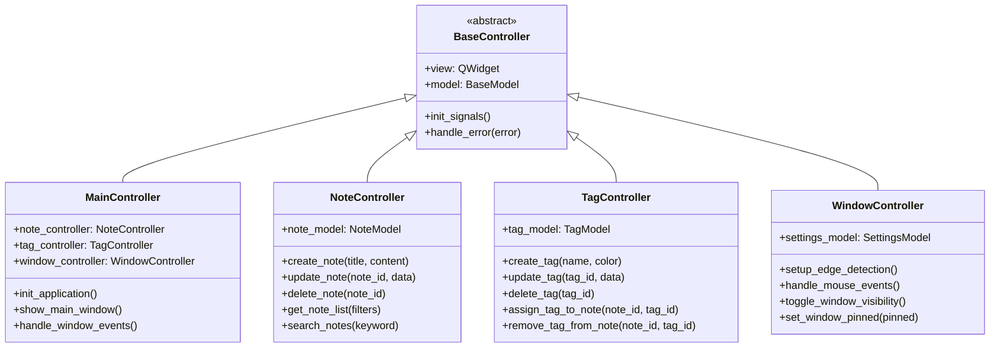

#### Model层组件

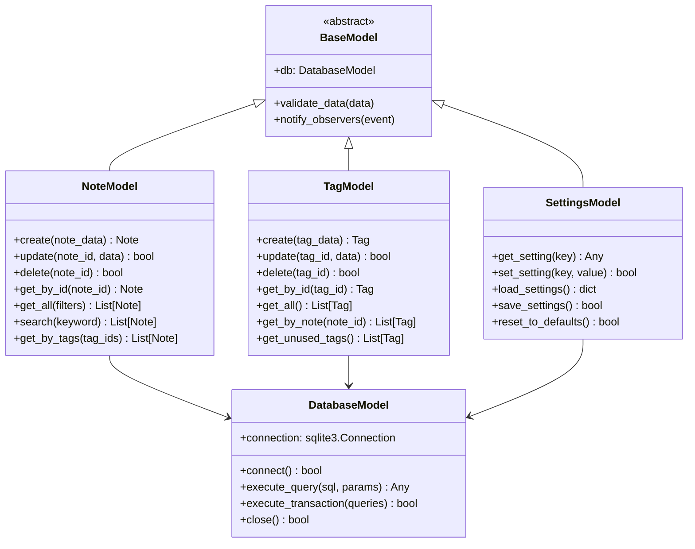

### 2.4 事件驱动架构

为了实现松耦合的MVC架构，系统采用事件驱动模式：

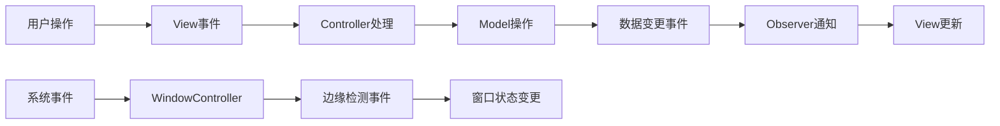

#### 事件类型定义

| 事件类型 | 触发条件 | 处理器 |
|----------|----------|--------|
| NoteCreated | 笔记创建成功 | MainController.refresh_note_list |
| NoteUpdated | 笔记更新成功 | MainController.update_note_display |
| NoteDeleted | 笔记删除成功 | MainController.refresh_note_list |
| TagAssigned | 标签分配给笔记 | MainController.update_tag_display |
| WindowStateChanged | 窗口状态改变 | WindowController.handle_state_change |
| MouseEdgeDetected | 鼠标触碰边缘 | WindowController.show_peek_window |

### 2.5 核心模块

#### 窗口管理模块 (WindowManager)
负责处理窗口的显示、隐藏、置顶等功能

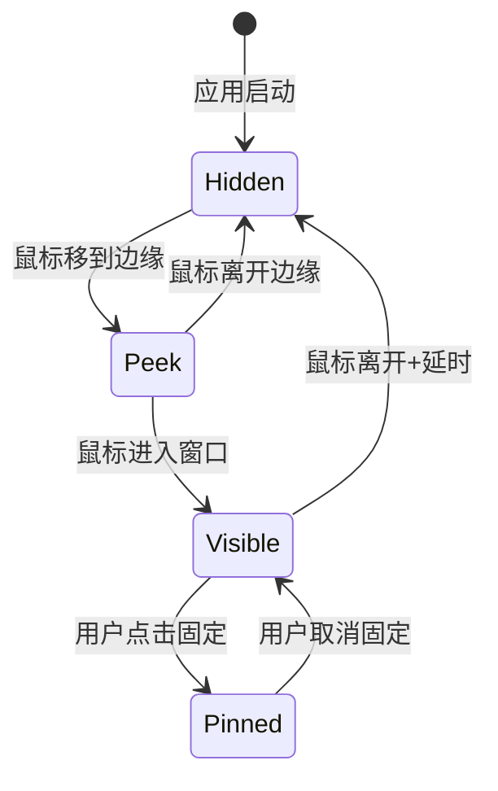

#### 笔记管理模块 (NoteManager)
处理笔记的CRUD操作和业务逻辑

#### 标签管理模块 (TagManager)
管理标签的创建、分配和删除

#### 搜索引擎 (SearchEngine)
提供全文搜索和标签筛选功能

## 3. 数据模型设计

### 3.1 数据库表结构

#### notes 表
| 字段名 | 类型 | 约束 | 说明 |
|-------|------|------|------|
| id | INTEGER | PRIMARY KEY | 笔记唯一标识 |
| title | TEXT | NOT NULL | 笔记标题 |
| content | TEXT | | 笔记内容 |
| created_at | DATETIME | DEFAULT CURRENT_TIMESTAMP | 创建时间 |
| updated_at | DATETIME | DEFAULT CURRENT_TIMESTAMP | 更新时间 |
| is_deleted | BOOLEAN | DEFAULT 0 | 软删除标记 |

#### tags 表
| 字段名 | 类型 | 约束 | 说明 |
|-------|------|------|------|
| id | INTEGER | PRIMARY KEY | 标签唯一标识 |
| name | TEXT | UNIQUE NOT NULL | 标签名称 |
| color | TEXT | DEFAULT '#007ACC' | 标签颜色 |
| created_at | DATETIME | DEFAULT CURRENT_TIMESTAMP | 创建时间 |

#### note_tags 表 (关联表)
| 字段名 | 类型 | 约束 | 说明 |
|-------|------|------|------|
| note_id | INTEGER | FOREIGN KEY | 笔记ID |
| tag_id | INTEGER | FOREIGN KEY | 标签ID |

### 3.2 数据实体关系

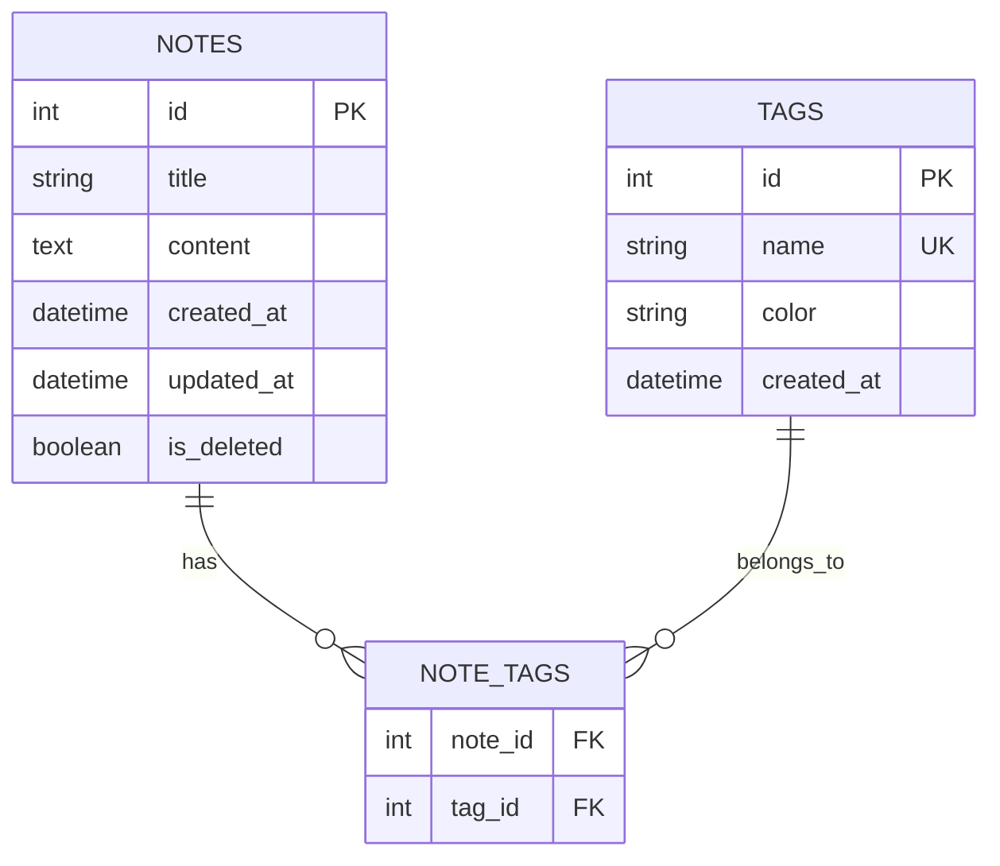

## 4. 用户界面设计

### 4.1 主窗口布局 (官方推荐结构)

根据PyQt-Fluent-Widgets官方文档推荐，采用`NavigationInterface + QStackedWidget`的标准布局方式：

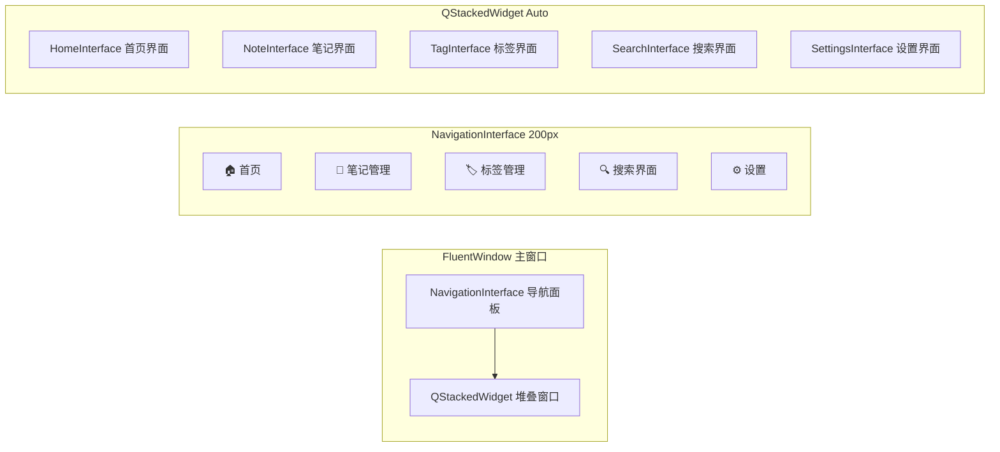

#### 官方推荐的布局结构

根据官方文档，主窗口采用以下层次结构：

```python
# 官方推荐的标准结构
class MainWindow(FluentWindow):
    def __init__(self):
        super().__init__()
        
        # 创建子界面
        self.homeInterface = HomeInterface()
        self.noteInterface = NoteInterface()
        self.tagInterface = TagInterface()
        self.searchInterface = SearchInterface()
        self.settingsInterface = SettingsInterface()
        
        # 使用 addSubInterface 添加到导航
        self.addSubInterface(self.homeInterface, FIF.HOME, "首页")
        self.addSubInterface(self.noteInterface, FIF.EDIT, "笔记")
        self.addSubInterface(self.tagInterface, FIF.TAG, "标签")
        self.addSubInterface(self.searchInterface, FIF.SEARCH, "搜索")
        
        # 设置界面放在底部
        self.addSubInterface(
            self.settingsInterface, 
            FIF.SETTING, 
            "设置", 
            NavigationItemPosition.BOTTOM
        )
```

#### 导航显示模式适配

| 窗口宽度 | 显示模式 | 说明 |
|---------|----------|------|
| ≥1008px | EXPAND | 完全展开导航面板 |
| <1007px | COMPACT | 只显示图标，折叠状态 |
| 点击菜单后 | MENU | 展开的导航菜单 |
| 极简模式 | MINIMAL | 只显示菜单按钮 |

#### 笔记管理界面布局

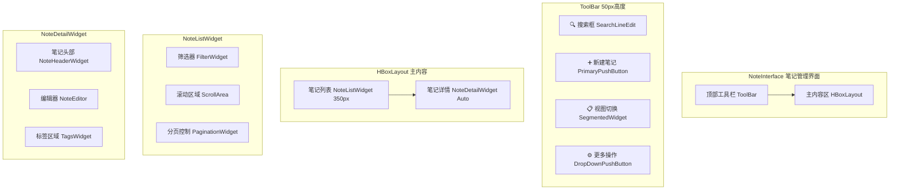

### 4.2 窗口状态管理 (边缘隐藏功能)

基于官方FluentWindow，扩展边缘隐藏功能：

| 状态 | 宽度 | 高度 | 位置 | 透明度 | 说明 |
|------|------|------|------|--------|------|
| 隐藏 | 5px | 屏幕高度 | 屏幕边缘 | 10% | 边缘触发条 |
| 预览 | 300px | 屏幕高度 | 屏幕边缘 | 90% | 鼠标悬停显示 |
| 完整 | 900px | 600px | 屏幕中央 | 100% | 完整功能界面 |
| 置顶 | 900px | 600px | 用户拖拽位置 | 100% | 固定在最上层 |

### 4.3 UI组件选择 (基于PyQt-Fluent-Widgets)

根据PyQt-Fluent-Widgets官方API文档，为项目选择合适的组件：

#### 主要界面组件

| 功能模块 | 组件选择 | 类名 | 说明 |
|---------|---------|------|------|
| 主窗口 | FluentWindow | `qfluentwidgets.window.FluentWindow` | 现代化无边框窗口 |
| 搜索框 | SearchLineEdit | `qfluentwidgets.components.widgets.LineEdit` | 带搜索图标的输入框 |
| 主按钮 | PrimaryPushButton | `qfluentwidgets.components.widgets.PushButton` | 主要操作按钮 |
| 普通按钮 | PushButton | `qfluentwidgets.components.widgets.PushButton` | 普通按钮 |
| 文本编辑器 | TextEdit | `qfluentwidgets.components.widgets.TextEdit` | 富文本编辑器 |
| 列表视图 | ListView | `qfluentwidgets.components.widgets.ListView` | 笔记列表显示 |
| 卡片容器 | CardWidget | `qfluentwidgets.components.widgets.CardWidget` | 笔记卡片容器 |
| 标签组件 | InfoBadge | `qfluentwidgets.components.widgets.InfoBadge` | 标签显示 |
| 右键菜单 | RoundMenu | `qfluentwidgets.components.widgets.Menu` | 圆角上下文菜单 |
| 消息框 | MessageBox | `qfluentwidgets.components.dialog_box.MessageBox` | 消息提示框 |
| 设置对话框 | MessageDialog | `qfluentwidgets.components.dialog_box.MessageDialog` | 自定义对话框 |
| 滚动区域 | ScrollArea | `qfluentwidgets.components.widgets.ScrollArea` | 平滑滚动区域 |
| 分割线 | HorizontalSeparator | `qfluentwidgets.components.widgets.Separator` | 水平分割线 |
| 开关按钮 | SwitchButton | `qfluentwidgets.components.widgets.SwitchButton` | 设置开关 |
| 滑块 | Slider | `qfluentwidgets.components.widgets.Slider` | 数值选择滑块 |
| 下拉框 | ComboBox | `qfluentwidgets.components.widgets.ComboBox` | 下拉选择框 |
| 进度环 | ProgressRing | `qfluentwidgets.components.widgets.ProgressRing` | 加载进度指示 |
| 信息栏 | InfoBar | `qfluentwidgets.components.widgets.InfoBar` | 操作结果提示 |
| 工具提示 | ToolTip | `qfluentwidgets.components.widgets.ToolTip` | 鼠标悬停提示 |

#### 导航组件

| 功能 | 组件选择 | 类名 | 用途 |
|------|---------|------|------|
| 侧边导航 | NavigationInterface | `qfluentwidgets.components.navigation.NavigationInterface` | 主导航栏 |
| 面包屑 | BreadcrumbBar | `qfluentwidgets.components.navigation.BreadcrumbBar` | 路径导航 |
| 分段控件 | SegmentedWidget | `qfluentwidgets.components.navigation.SegmentedWidget` | 标签页切换 |
| 透视组件 | Pivot | `qfluentwidgets.components.navigation.Pivot` | 内容分组 |

#### 特殊效果组件

| 效果 | 组件选择 | 类名 | 应用场景 |
|------|---------|------|----------|
| 亚克力效果 | AcrylicLabel | `qfluentwidgets.components.material.AcrylicLabel` | 背景模糊效果 |
| 浮出菜单 | Flyout | `qfluentwidgets.components.widgets.Flyout` | 快捷操作菜单 |
| 教学提示 | TeachingTip | `qfluentwidgets.components.widgets.TeachingTip` | 功能引导 |
| 状态提示 | StateToolTip | `qfluentwidgets.components.widgets.StateToolTip` | 操作状态提示 |

#### 设置界面组件

| 功能 | 组件选择 | 类名 | 说明 |
|------|---------|------|------|
| 设置卡片 | SettingCard | `qfluentwidgets.components.settings.SettingCard` | 基础设置项 |
| 可展开设置卡 | ExpandSettingCard | `qfluentwidgets.components.settings.ExpandSettingCard` | 复杂设置项 |
| 选项设置卡 | OptionsSettingCard | `qfluentwidgets.components.settings.OptionsSettingCard` | 多选项设置 |
| 颜色设置卡 | CustomColorSettingCard | `qfluentwidgets.components.settings.CustomColorSettingCard` | 颜色选择 |
| 文件夹设置卡 | FolderListSettingCard | `qfluentwidgets.components.settings.FolderListSettingCard` | 路径设置 |
| 设置组 | SettingCardGroup | `qfluentwidgets.components.settings.SettingCardGroup` | 设置分组 |

#### 布局组件

| 布局类型 | 组件选择 | 类名 | 用途 |
|----------|---------|------|------|
| 流式布局 | FlowLayout | `qfluentwidgets.components.layout.FlowLayout` | 标签自动换行 |
| 垂直布局 | VBoxLayout | `qfluentwidgets.components.layout.VBoxLayout` | 垂直排列 |
| 可展开布局 | ExpandLayout | `qfluentwidgets.components.layout.ExpandLayout` | 动态展开收缩 |

### 4.4 组件使用示例 (官方推荐写法)

#### 主窗口初始化 - 官方标准结构
```python
from qfluentwidgets import FluentWindow, NavigationItemPosition, FluentIcon as FIF
from qfluentwidgets import setTheme, Theme

class MainWindow(FluentWindow):
    def __init__(self):
        super().__init__()
        self.setWindowTitle("轻量笔记管理器")
        self.resize(1200, 800)
        
        # 设置主题
        setTheme(Theme.AUTO)
        
        # 创建界面实例
        self.homeInterface = HomeInterface(self)
        self.noteInterface = NoteInterface(self)
        self.tagInterface = TagInterface(self)
        self.searchInterface = SearchInterface(self)
        self.settingsInterface = SettingsInterface(self)
        
        # 使用官方推荐的 addSubInterface 方法
        self.initNavigation()
        
        # 设置默认页面
        self.navigationInterface.setDefaultRouteKey(self.homeInterface.objectName())
        
    def initNavigation(self):
        """初始化导航菜单 - 官方推荐方式"""
        # 主要功能页面 - 放在顶部
        self.addSubInterface(
            self.homeInterface, 
            FIF.HOME, 
            "首页",
            NavigationItemPosition.TOP
        )
        
        self.addSubInterface(
            self.noteInterface, 
            FIF.EDIT, 
            "笔记管理",
            NavigationItemPosition.TOP
        )
        
        self.addSubInterface(
            self.tagInterface, 
            FIF.TAG, 
            "标签管理",
            NavigationItemPosition.TOP
        )
        
        # 搜索功能 - 放在滚动区域
        self.addSubInterface(
            self.searchInterface,
            FIF.SEARCH,
            "高级搜索",
            NavigationItemPosition.SCROLL
        )
        
        # 设置页面 - 放在底部
        self.addSubInterface(
            self.settingsInterface,
            FIF.SETTING,
            "设置",
            NavigationItemPosition.BOTTOM
        )
```

#### 笔记界面实现 - 采用标准布局
```python
from qfluentwidgets import (
    ScrollArea, VBoxLayout, HBoxLayout, 
    SearchLineEdit, PrimaryPushButton, SegmentedWidget,
    CardWidget, ListView, TextEdit
)

class NoteInterface(ScrollArea):
    """笔记管理界面 - 官方推荐结构"""
    
    def __init__(self, parent=None):
        super().__init__(parent)
        self.setObjectName('NoteInterface')
        
        # 创建主容器
        self.view = QWidget()
        self.setWidget(self.view)
        self.setWidgetResizable(True)
        
        # 设置布局
        self.vBoxLayout = VBoxLayout(self.view)
        
        # 初始化UI
        self.initToolBar()
        self.initContentArea()
        
    def initToolBar(self):
        """初始化顶部工具栏"""
        self.toolBar = QWidget()
        self.toolBarLayout = HBoxLayout(self.toolBar)
        
        # 搜索框
        self.searchEdit = SearchLineEdit()
        self.searchEdit.setPlaceholderText("搜索笔记...")
        self.searchEdit.setFixedWidth(300)
        
        # 新建按钮
        self.newNoteBtn = PrimaryPushButton("新建笔记")
        
        # 视图切换
        self.viewToggle = SegmentedWidget()
        self.viewToggle.addItem(‘list’, "列表视图", lambda: self.switchView('list'))
        self.viewToggle.addItem(‘card’, "卡片视图", lambda: self.switchView('card'))
        
        # 添加到布局
        self.toolBarLayout.addWidget(self.searchEdit)
        self.toolBarLayout.addStretch()
        self.toolBarLayout.addWidget(self.viewToggle)
        self.toolBarLayout.addWidget(self.newNoteBtn)
        
        self.vBoxLayout.addWidget(self.toolBar)
        
    def initContentArea(self):
        """初始化主内容区域"""
        self.contentWidget = QWidget()
        self.contentLayout = HBoxLayout(self.contentWidget)
        
        # 笔记列表
        self.noteListWidget = self.createNoteListWidget()
        
        # 笔记详情
        self.noteDetailWidget = self.createNoteDetailWidget()
        
        # 设置比例
        self.contentLayout.addWidget(self.noteListWidget, 1)
        self.contentLayout.addWidget(self.noteDetailWidget, 2)
        
        self.vBoxLayout.addWidget(self.contentWidget)
        
    def createNoteListWidget(self) -> QWidget:
        """创建笔记列表组件"""
        widget = QWidget()
        widget.setFixedWidth(350)
        layout = VBoxLayout(widget)
        
        # 笔记列表
        self.noteListView = ListView()
        layout.addWidget(self.noteListView)
        
        return widget
        
    def createNoteDetailWidget(self) -> QWidget:
        """创建笔记详情组件"""
        widget = CardWidget()
        layout = VBoxLayout(widget)
        
        # 笔记编辑器
        self.noteEditor = TextEdit()
        layout.addWidget(self.noteEditor)
        
        return widget
```

#### 标签管理组件 - 使用官方推荐的FlowLayout
```python
from qfluentwidgets import FlowLayout, InfoBadge, PushButton

class TagsWidget(QWidget):
    """标签管理组件 - 使用流式布局"""
    
    def __init__(self, parent=None):
        super().__init__(parent)
        
        # 使用官方推荐的FlowLayout
        self.flowLayout = FlowLayout(self)
        
        # 添加标签按钮
        self.addTagBtn = PushButton("添加标签")
        self.flowLayout.addWidget(self.addTagBtn)
        
    def addTag(self, tag_name: str, tag_color: str = '#007ACC'):
        """添加标签 - 使用InfoBadge显示"""
        tag_badge = InfoBadge(tag_name)
        tag_badge.setCustomBackgroundColor(tag_color, tag_color)
        
        # 添加删除功能
        tag_badge.clicked.connect(lambda: self.removeTag(tag_badge))
        
        # 插入到添加按钮之前
        index = self.flowLayout.count() - 1
        self.flowLayout.insertWidget(index, tag_badge)
        
    def removeTag(self, tag_badge: InfoBadge):
        """移除标签"""
        self.flowLayout.removeWidget(tag_badge)
        tag_badge.deleteLater()
```

## 5. 核心功能实现

### 5.1 边缘检测与鼠标监听

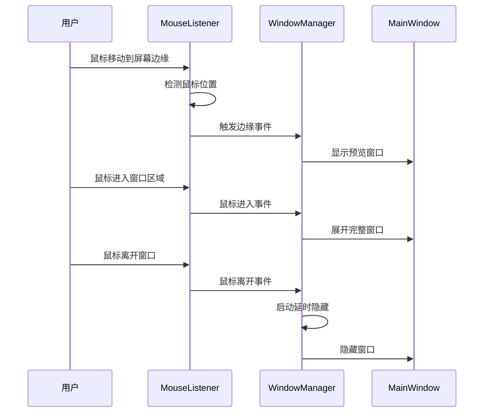

### 5.2 笔记管理流程

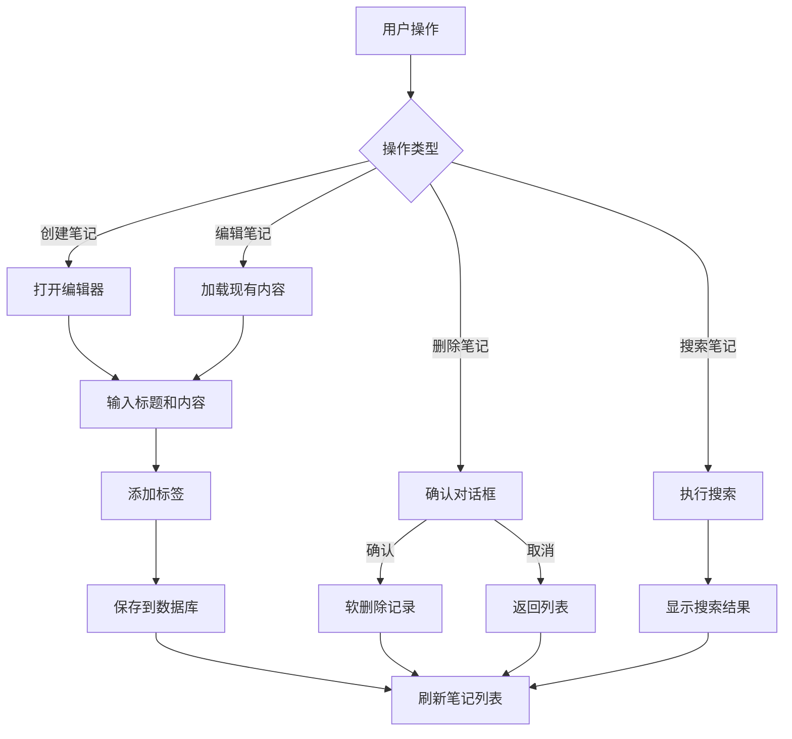

### 5.3 标签管理系统

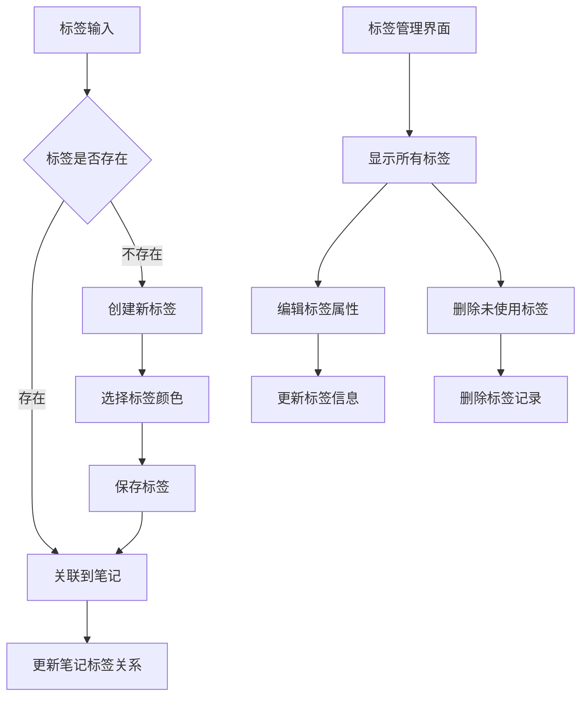

## 6. 系统集成与性能优化

### 6.1 Windows系统集成

| 功能 | 实现方案 | API/库 |
|------|---------|--------|
| 全局鼠标监听 | Windows API Hook | pynput |
| 屏幕边缘检测 | 获取屏幕分辨率和鼠标位置 | PyQt5.QtGui |
| 窗口置顶 | 设置窗口标志 | Qt.WindowStaysOnTopHint |
| 系统托盘 | 托盘图标和菜单 | QSystemTrayIcon |
| 开机自启 | 注册表或启动文件夹 | winreg |

### 6.2 性能优化策略

#### 内存管理
- 使用对象池管理UI组件
- 实现笔记内容的懒加载
- 及时释放不需要的资源

#### 数据库优化
- 为常用查询字段建立索引
- 使用连接池管理数据库连接
- 实现查询结果缓存

#### UI响应优化
- 异步加载大量笔记内容
- 使用虚拟滚动处理长列表
- 实现增量搜索和结果预加载

### 6.3 缓存策略

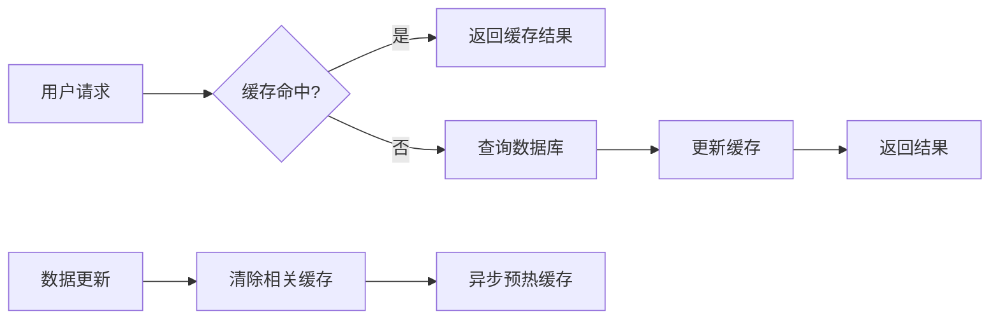

## 7. 测试策略

### 7.1 单元测试覆盖

| 模块 | 测试重点 | 工具 |
|------|---------|------|
| 数据访问层 | CRUD操作、数据完整性 | pytest |
| 业务逻辑层 | 核心功能逻辑 | unittest |
| UI组件 | 界面交互逻辑 | pytest-qt |
| 系统集成 | 鼠标事件、窗口管理 | 手动测试 |

### 7.2 测试用例设计

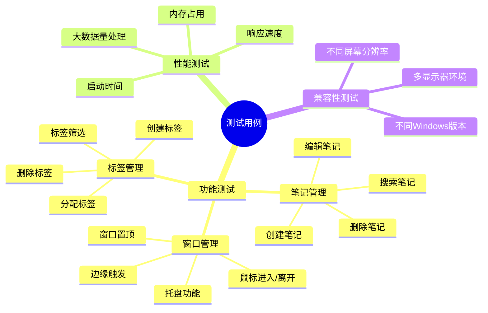

### 7.3 自动化测试流程

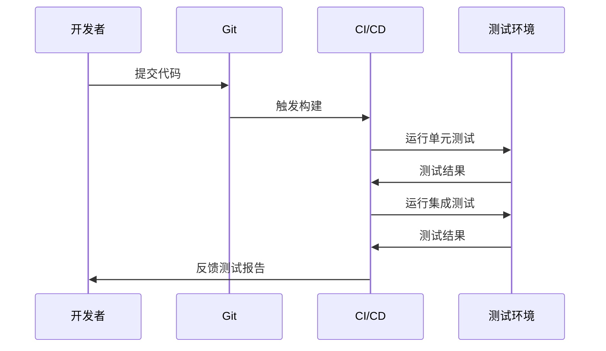